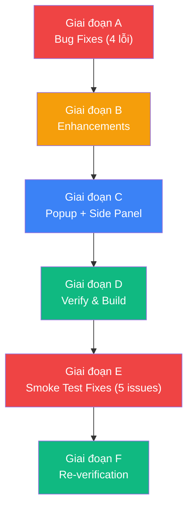
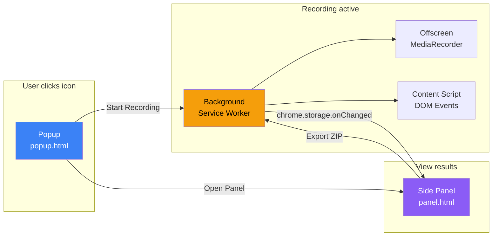

# Plan UAT — Bug Fixes + Enhancements + Big Feature (Popup → Side Panel)

> **Nguồn:** [FEEDBACKS.md](feedbacks/FEEDBACKS.md) + [SMOKE_TEST_RESULTS.md](feedbacks/SMOKE_TEST_RESULTS.md)  
> **Trạng thái:** Phase A-D done, Phase E-F chờ duyệt  
> **Ước tính effort:** ~6 giai đoạn (A → B → C → D → E → F)

---

## Tổng quan thay đổi



---

## Giai đoạn A — Bug Fixes (4 lỗi)

### A1. Lỗi 1 — CSP violation: inline script bị block

> **Triệu chứng:** `Executing inline script violates Content Security Policy directive 'script-src ...'`  
> **File lỗi:** `src/content/eventCollector.js` dòng 28-45

**Root Cause:**  
Hàm `injectPageConsoleCapture()` tạo `<script>` tag với `textContent` inline rồi append vào DOM của page. Các trang web có CSP strict (như `uat-admin.sdax.co`) cấm inline script → script bị block → console capture không hoạt động → **gây ra cả Lỗi 3** (không tracking được event phần console).

**Giải pháp:**  
Thay thế inline `<script>` injection bằng cách tạo file riêng biệt CSP-compliant:

Tạo file `src/content/page-console-capture.js` riêng biệt, đăng ký trong `manifest.json` dưới `web_accessible_resources`, rồi inject bằng URL:

```js
const script = document.createElement('script')
script.src = chrome.runtime.getURL('src/content/page-console-capture.js')
document.documentElement.appendChild(script)
script.onload = () => script.remove()
```

File `page-console-capture.js` chứa phần `(function(){ const _orig = console.error... })()` — code hiện đang nằm inline trong `textContent`.

**Files cần thay đổi:**

| File | Thao tác |
|---|---|
| `src/content/page-console-capture.js` | **[NEW]** — Tách code console capture ra file riêng |
| `src/content/eventCollector.js` | **[MODIFY]** — `injectPageConsoleCapture()` inject bằng script.src thay vì textContent |
| `manifest.json` | **[MODIFY]** — Thêm `page-console-capture.js` vào `web_accessible_resources` |

---

### A2. Lỗi 2 — Preview tab ERR_FILE_NOT_FOUND

> **Triệu chứng:** `chrome-extension://.../src/preview/index.html` → ERR_FILE_NOT_FOUND

**Root Cause:**  
File `dist/src/preview/index.html` tồn tại trong build output, NHƯNG file JS/CSS bên trong nó dùng **absolute path** (`/src/preview/index.js`, `/index.css`, `/messages.js`). Trong context extension `chrome-extension://`, absolute paths resolve sai → file không load được → trắng trang.

Nguyên nhân sâu hơn: Vite build mặc định `base: '/'` (absolute). Cần set `base: ''` hoặc `base: './'` để output relative paths trong HTML.

Sau khi build thì file đã compile:
```html
<!-- HIỆN TẠI (BUG) — absolute paths: -->
<script type="module" crossorigin src="/src/preview/index.js"></script>
<link rel="stylesheet" crossorigin href="/index.css">

<!-- SAU KHI FIX — relative paths: -->
<script type="module" crossorigin src="./index.js"></script>
<link rel="stylesheet" crossorigin href="../../index.css">
```

**Giải pháp:**  
Thêm `base: ''` vào Vite config:

```js
// vite.config.js
export default defineConfig({
  base: '',  // ← Extension HTML cần relative paths vì chạy trong chrome-extension://
  // ...
})
```

**Files cần thay đổi:**

| File | Thao tác |
|---|---|
| `vite.config.js` | **[MODIFY]** — Thêm `base: ''` |

> ⚠️ **Warning:** Cần verify rằng thay `base` không ảnh hưởng offscreen.html. Cả hai HTML đều nằm trong subdirectory → đều cần relative paths → fix này áp dụng chung.

---

### A3. Lỗi 3 — Không tracking được DOM click & console.error

> **Triệu chứng:** Network API vẫn track được, nhưng click/input events = trống, console errors = trống.

**Root Cause (kép):**

1. **Console capture bị block bởi CSP** → đã giải quyết ở A1.

2. **Content script `eventCollector.js` có thể không nhận được message `START_RECORDING`**: Khi content script inject vào page lần đầu (`document_idle`), nó chỉ listen `chrome.runtime.onMessage`. Nếu Background gửi `START_RECORDING` trước khi content script load xong (race condition trên slow page), message bị mất → `startCollecting()` không bao giờ được gọi → không có DOM events.

   Thêm nữa, content script hiện tại không thử kiểm tra "Background đã bắt đầu record chưa?" khi nó khởi tạo. Nó chỉ phản ứng khi *nhận* message.

**Giải pháp:**

1. Fix CSP inline script (A1).
2. Thêm **startup check** trong `src/content/index.js`: Khi content script vừa load xong, gửi một message hỏi Background "đang record không?" → nếu có → gọi `startCollecting()` ngay lập tức.

```js
// src/content/index.js — thêm sau khi register listener
// Startup check: nếu record đang chạy mà content script load muộn
chrome.runtime.sendMessage({ type: MSG.QUERY_STATUS }, (res) => {
  if (res?.status === 'recording') {
    startCollecting()
    showBadge()
  }
})
```

Background cần handle `QUERY_STATUS`:
```js
if (msg.type === MSG.QUERY_STATUS) {
  const state = await getState()
  sendResponse({ status: state.status, startTime: state.startTime })
  return true
}
```

**Files cần thay đổi:**

| File | Thao tác |
|---|---|
| `src/shared/messages.js` | **[MODIFY]** — Thêm `QUERY_STATUS` constant |
| `src/content/index.js` | **[MODIFY]** — Thêm startup check |
| `src/background/index.js` | **[MODIFY]** — Handle `QUERY_STATUS` message, return true cho sendResponse async |

---

### A4. Lỗi 4 — Không thể record lần 2 (icon click không phản hồi)

> **Triệu chứng:** Sau khi record + stop thành công lần 1, click icon lần 2 không có gì xảy ra.

**Root Cause:**  
Trong `background/index.js` hiện tại (file trên disk), `action.onClicked` chỉ xử lý `state.status === 'idle'`. Sau khi gọi `finalizeSession()`, status vẫn là `'stopped'` (không được reset về `'idle'`).

**Giải pháp:**

1. Trong `finalizeSession()`: thêm `await setState({ status: 'idle' })` TRƯỚC khi mở preview/panel.
2. Trong `action.onClicked`: mở rộng điều kiện thành `state.status === 'idle' || state.status === 'stopped'`.

**Files cần thay đổi:**

| File | Thao tác |
|---|---|
| `src/background/index.js` | **[MODIFY]** — Fix status transition |

---

## Giai đoạn B — Enhancements

### B1. Loại bỏ scroll tracking

**Giải pháp:** Xóa toàn bộ `onScrollEvent`, `SCROLL_DEBOUNCE_MS`, `scrollTimer`, và listener `'scroll'` khỏi `eventCollector.js`.

| File | Thao tác |
|---|---|
| `src/content/eventCollector.js` | **[MODIFY]** — Xóa scroll tracking |

---

### B2. DOM click hiển thị text content thay vì CSS classes

> **Triệu chứng:** Event click hiển thị `button.items-center.cursor-pointer` — không có ý nghĩa.

**Giải pháp:** Rewrite hàm `buildSelector(el)`:

```
Priority mới:
1. id → tag#id
2. aria-label / name / title → tag[label]
3. Nếu element có innerText ngắn (≤ 30 chars) → tag ("Nội dung text")
4. Nếu element có innerText dài → tag ("Nội dung text cắt 30 ký tự...")
5. Fallback: tag.className (giữ max 2 class)
```

Walk-up strategy cho click event: Nếu target element không có text (ví dụ `<svg>` icon bên trong `<button>`), walk up tới parent có text content.

| File | Thao tác |
|---|---|
| `src/content/eventCollector.js` | **[MODIFY]** — Rewrite `buildSelector()` |

---

### B3. Đổi "API Errors" → "Network" + hiển thị tất cả requests

**Giải pháp:**

- Background: Rename `state.apiErrors` → `state.apiRequests`. Track **tất cả** requests (không chỉ `>= 400`).
- Preview/Panel: Rename tab "API Errors" → "Network". Hiển thị:
  - 🟢 2xx = Green (Success)
  - 🔴 4xx/5xx/0 = Red (Error)
- Export: Chỉ tạo cURL file cho requests được **check chọn** (mặc định chỉ errors được pre-select).

| File | Thao tác |
|---|---|
| `src/background/index.js` | **[MODIFY]** — Track all requests, rename apiErrors → apiRequests |
| `src/preview/App.jsx` | **[MODIFY]** — Rename tab + use `apiRequests` |
| `src/preview/ApiErrorPanel.jsx` → `src/preview/NetworkPanel.jsx` | **[RENAME + MODIFY]** — Show success + error |
| `src/utils/zipExporter.js` | **[MODIFY]** — Use `selectedApiRequests` for cURL export |
| `src/utils/markdownBuilder.js` | **[MODIFY]** — Rename section, add status markers ✅/❌ |

---

### B4. Network tab: Filter by status + search by URL

**Giải pháp:** Thêm filter bar trong `NetworkPanel.jsx`:

```
┌────────────────────────────────────────────────────┐
│ [All] [Success] [Error]   🔍 Filter by URL        │
├────────────────────────────────────────────────────┤
│ ... rendered requests ...                          │
└────────────────────────────────────────────────────┘
```

- **Status filter pills:** `All` | `Success (2xx)` | `Error (4xx/5xx)` | `Failed (0)` — click để toggle.
- **URL search input:** Filter requests hiển thị theo substring match trên URL. Debounce 300ms.
- Filter logic hoàn toàn client-side, không ảnh hưởng data capture.

| File | Thao tác |
|---|---|
| `src/preview/NetworkPanel.jsx` (hoặc `src/panel/NetworkPanel.jsx` nếu làm cùng C) | **[MODIFY]** — Thêm filter bar + search |

---

## Giai đoạn C — Big Feature: Popup + Side Panel

Đây là thay đổi kiến trúc lớn nhất, chuyển từ **"click icon → toggle recording → mở tab mới"** sang **"Popup để start → Side Panel hiển thị kết quả song song"**.

### C0. Tổng quan kiến trúc mới



### C1. Manifest changes

```json
{
  "action": {
    "default_popup": "src/popup/popup.html",
    "default_icon": { "16": "...", "48": "...", "128": "..." }
  },
  "side_panel": {
    "default_path": "src/panel/panel.html"
  },
  "permissions": [
    "activeTab", "storage", "downloads", "debugger",
    "offscreen", "notifications", "tabCapture",
    "sidePanel"
  ]
}
```

> ⚠️ **Quan trọng:** Khi thêm `default_popup`, Chrome sẽ KHÔNG còn fire `action.onClicked` nữa. Popup sẽ thay thế vai trò toggle recording. Background cần refactor: remove `action.onClicked` và thay bằng xử lý message từ Popup.

### C2. Popup — Design Spec (tham khảo `design/popup.png`)

**File mới:** `src/popup/popup.html` + `src/popup/Popup.jsx`  
**Width:** 420px fixed (Chrome popup max)

#### C2.1 Layout — State: Idle (Ready)

```
┌──────────────────────────────────────────┐
│  🐛 VCAP DEBUGGER          [ Ready ●  ] │  ← Header: status pill cyan
│                                  [?] [⚙] │
├──────────────────────────────────────────┤
│  TICKET INFO                             │
│  ┌────────────────────────────────────┐  │
│  │ Enter Ticket ID / Session Name...  │  │  ← input[type=text]
│  └────────────────────────────────────┘  │
├──────────────────────────────────────────┤
│  ┌────────────────────────────┐  ┌────┐  │
│  │  ▶  START RECORDING        │  │ 📷 │  │  ← CTA (cyan gradient) + Camera btn
│  └────────────────────────────┘  └────┘  │
│       13 events  •  26s  •  0 screenshots │  ← Stats row (live)
├──────────────────────────────────────────┤
│  ┌────────────────────────────────────┐  │
│  │  □  OPEN FULL PANEL                │  │  ← Secondary outlined btn
│  └────────────────────────────────────┘  │
├──────────────────────────────────────────┤
│  ┌────────────────────────────────────┐  │
│  │  📄  Export Markdown          🎬🖼📋│  │  ← Quick export btn
│  └────────────────────────────────────┘  │
├──────────────────────────────────────────┤
│  RECENT SESSIONS                         │
│  📁 BUG-123_2026-04-11  14:30 · 13ev 2📷│  ↗
│  📁 BUG-456_2026-04-10  09:15 · 8ev  0📷│  ↗  ← Clickable → opens panel
└──────────────────────────────────────────┘
```

#### C2.2 Layout — State: Recording (Orange)

```
┌──────────────────────────────────────────┐
│  🐛 VCAP DEBUGGER       [ ● Recording ] │  ← dot + text đều màu #f97300
│                                  [?] [⚙] │
├──────────────────────────────────────────┤
│  TICKET INFO                             │
│  ┌────────────────────────────────────┐  │
│  │ BUG-123 (disabled, opacity 40%)    │  │  ← input bị lock khi recording
│  └────────────────────────────────────┘  │
├──────────────────────────────────────────┤
│  ┌────────────────────────────┐  ┌────┐  │
│  │  ■  STOP RECORDING         │  │ 📷 │  │  ← CTA chuyển sang ORANGE GRADIENT
│  └────────────────────────────┘  └────┘  │
│       24 events  •  1m 12s  •  2 screenshots│
├──────────────────────────────────────────┤
│  ┌────────────────────────────────────┐  │
│  │  □  OPEN FULL PANEL                │  │
│  └────────────────────────────────────┘  │
├──────────────────────────────────────────┤
│  ┌────────────────────────────────────┐  │
│  │  📄  Export Markdown          🎬🖼📋│  │  ← Còn active khi recording
│  └────────────────────────────────────┘  │
├──────────────────────────────────────────┤
│  RECENT SESSIONS (unchanged)             │
└──────────────────────────────────────────┘
```

#### C2.3 Button Design Tokens

| Button | State Idle | State Recording |
|---|---|---|
| **START/STOP** | `linear-gradient(135deg, #00b4d8 → #00e3fd → #81ecff)` | `linear-gradient(135deg, #b35000 → #f97300 → #ffaa55)` |
| Text color | `#003840` (dark on cyan) | `#ffffff` (white on orange) |
| Icon | `▶ play_arrow` (filled) | `■ stop` (filled) |
| Label | `START RECORDING` | `STOP RECORDING` |
| Status dot | `bg-primary` (cyan), static | `bg-[#f97300]`, pulse animation |
| Status text | `Ready` (gray) | `Recording` (orange `#f97300`) |
| Ticket input | enabled | disabled, opacity 40% |

#### C2.4 Screenshot Capture Button (📷)

- **Position:** Ngay phải button Start/Stop, size `52×52px`, `rounded-xl`
- **Style idle:** `bg-surface-container`, `border: 1px solid #262626`, icon màu `#ababab`
- **Hover:** `bg-surface-container-high`, icon màu `#81ecff` (cyan), border `#81ecff55`
- **Click feedback:** Flash animation ngắn (orange → reset 350ms) + số screenshot tăng trong stats row
- **Action:** Gửi `MSG.TAKE_SCREENSHOT` → Background gọi `chrome.tabs.captureVisibleTab()` → lưu blob vào `IndexedDB` table `screenshots` + tăng counter trong `vcapState`
- **Lưu ý:** Hoạt động cả khi KHÔNG đang record (chụp standalone)

#### C2.5 Export Markdown Button

> **Quick Export** — toàn bộ dữ liệu session hiện tại, export ngay không cần preview

- **Nội dung ZIP bao gồm:**
  - 🎬 `bug-record.webm` — video screen recording
  - 📋 `jira-ticket.md` — DOM steps + Network requests (all) + Console errors
  - 🖼 `screenshots/` — tất cả ảnh chụp nhanh (`shot-001.png`, `shot-002.png`, ...)
  - 🔌 `postman-curl/` — cURL files cho **selected** API errors
- **Filename:** `{TicketName}_{YYYY-MM-DD}_{HH-mm-ss}.zip`
- **Action:** Gửi `MSG.EXPORT_SESSION` → Background gọi `exportSession()` → `chrome.downloads.download()`
- **Enabled khi:** Có ít nhất 1 event HOẶC 1 screenshot HOẶC video > 0 bytes
- **Disabled khi:** Hoàn toàn trống (mới mở extension, chưa làm gì)
- **Icon hint** (nhỏ, bên phải button): `video_file | image | view_list | terminal` → 4 icon nhỏ 10px để hint nội dung

#### C2.6 Stats Row

```
13 events  •  26s  •  0 screenshots
```

- Cập nhật real-time từ `chrome.storage.onChanged` lắng nghe `vcapState`
- `events` = tổng `steps.length`
- `time` = `Date.now() - vcapState.startTime` (chỉ hiển thị khi recording)
- `screenshots` = `vcapState.screenshots.length`

**Logic:**

1. **Ticket ID input**: Saved to `chrome.storage.local` key `vcapTicketName`.
2. **Start Recording**: Sends `MSG.START_RECORDING_REQUEST` → Background → `startRecording(activeTab.id)` → popup tự đóng (`window.close()`).
3. **Stop Recording**: Sends `MSG.STOP_RECORDING_REQUEST` → Background → `stopRecording()` → popup cập nhật UI.
4. **Screenshot**: Sends `MSG.TAKE_SCREENSHOT` → `chrome.tabs.captureVisibleTab()` → lưu IDB.
5. **Export Markdown**: Sends `MSG.EXPORT_SESSION` → `exportSession({ includeScreenshots: true })`.
6. **Open Full Panel**: Calls `chrome.sidePanel.open({ windowId })`.
7. **Recent Sessions**: Reads `chrome.storage.local.vcapSessions` (last 5).
8. **State sync**: On popup open → `MSG.QUERY_STATUS` → read `vcapState`.

**Files mới:**

| File | Thao tác |
|---|---|
| `src/popup/popup.html` | **[NEW]** |
| `src/popup/Popup.jsx` | **[NEW]** — Popup UI (idle + recording states) |
| `src/popup/main.jsx` | **[NEW]** — React entry |
| `src/popup/popup.css` | **[NEW]** — Compact styles, 420px width |

### C3. Side Panel (Giai đoạn 2 từ feedback)

**File mới:** `src/panel/panel.html` + port hiện tại `App.jsx` sang panel context.

Side Panel chính là **giao diện hiện tại** (tham khảo `current_ui.png` và `right_panel.png`) nhưng rendered trong side panel thay vì tab mới.

**Key differences từ tab preview:**

- Width nhỏ hơn (~350-400px thay vì full screen) → cần responsive layout.
- **Live data**: Panel sẽ listen `chrome.storage.onChanged` để cập nhật real-time khi recording đang chạy (không cần đợi stop mới thấy data).
- **Ticket name** hiển thị ở header, đọc từ `chrome.storage.local`.
- **Export ZIP**: Filename format thay đổi → `{TicketName}_{Date}_{Time}.zip`

**Migration path:**

| File hiện tại | → File mới | Ghi chú |
|---|---|---|
| `src/preview/App.jsx` | `src/panel/App.jsx` | Port + responsive cho width hẹp |
| `src/preview/NetworkPanel.jsx` | `src/panel/NetworkPanel.jsx` | Copy + thêm filter (B4) |
| `src/preview/MarkdownPanel.jsx` | `src/panel/MarkdownPanel.jsx` | Copy |
| `src/preview/index.html` | `src/panel/panel.html` | New HTML entry |
| `src/preview/main.jsx` | `src/panel/main.jsx` | New entry, listen storage changes |
| `src/preview/index.css` | `src/panel/panel.css` | Adapt for narrower width |

> 📝 **Note:** Giữ lại `src/preview/` cũ tạm thời để không break flow hiện tại. Sau khi Side Panel ổn định → deprecate & xóa preview tab.

### C4. Background refactor

**Thay đổi lớn:**

| Hiện tại | Mới |
|---|---|
| `action.onClicked` → toggle recording | **Xóa**. Popup handles start/stop via messages |
| `finalizeSession()` → mở tab preview | `finalizeSession()` → lưu session + notify Side Panel via storage change |
| `state.status` chỉ lưu trong `chrome.storage.session` | Thêm `vcapTicketName` từ `chrome.storage.local` |
| Chỉ lưu session hiện tại | Lưu thêm `vcapSessions` (mảng 5 sessions gần nhất) vào `chrome.storage.local` |

**Messages mới cần thêm vào `src/shared/messages.js`:**

```js
// Popup → Background
START_RECORDING_REQUEST: 'START_RECORDING_REQUEST',
STOP_RECORDING_REQUEST: 'STOP_RECORDING_REQUEST',

// Popup → Background: chụp screenshot tab hiện tại
TAKE_SCREENSHOT: 'TAKE_SCREENSHOT',

// Popup → Background: quick export
EXPORT_SESSION: 'EXPORT_SESSION',

// Content/Popup → Background (query current status)
QUERY_STATUS: 'QUERY_STATUS',
```

### C5. Vite config & manifest updates

```js
// vite.config.js — thêm entrypoints
additionalInputs: [
  'src/popup/popup.html',
  'src/panel/panel.html',
  'src/offscreen/offscreen.html',
  // Legacy (xóa sau khi panel ổn định)
  'src/preview/index.html',
],
```

### C6. Data sync (Storage-based real-time)

Flow dữ liệu khi recording:

```
Background captures event
  → setState({ steps: [...] })
    → chrome.storage.session.set({ vcapState })
      → Side Panel listens chrome.storage.onChanged
        → Re-renders UI with new data
```

Điều này có nghĩa Side Panel **thấy events real-time** trong khi recording, không cần đợi stop.

### C7. ZIP / Export Convention

#### Filename format

```
{TicketName}_{YYYY-MM-DD}_{HH-mm-ss}.zip
Ví dụ: BUG-123_2026-04-11_14-30-00.zip
```

Nếu không có ticket name: `vcap_{YYYY-MM-DD}_{HH-mm-ss}.zip`

#### ZIP structure (updated — bao gồm screenshots)

```
bug-report-BUG-123_2026-04-11_14-30-00.zip
├── bug-record.webm              ← screen recording video
├── jira-ticket.md               ← full markdown report
├── screenshots/
│   ├── shot-001_00-15.png       ← format: shot-{index}_{mm-ss}.png
│   ├── shot-002_01-42.png
│   └── ...
└── postman-curl/
    └── 00-09_POST-api-auth-login.txt
```

#### Screenshot storage (IDB)

- **Store name:** `screenshots` (cùng DB với `video`)
- **Key:** auto-increment index
- **Value:** `{ blob: Blob, timestamp: string, tabId: number }`
- **Capture:** `chrome.tabs.captureVisibleTab(tabId, { format: 'png' })` → Background → trả về dataURL → convert sang Blob → lưu IDB

| File | Thao tác |
|---|---|
| `src/utils/zipExporter.js` | **[MODIFY]** — Accept ticketName, screenshots, build filename |
| `src/utils/idb.js` | **[MODIFY]** — Thêm `screenshots` store, `appendScreenshot()`, `readAllScreenshots()` |
| `src/background/index.js` | **[MODIFY]** — Handle `MSG.TAKE_SCREENSHOT`, `MSG.EXPORT_SESSION` |

---

## Giai đoạn D — Verification

### D1. Unit Tests

- Update `markdownBuilder.test.js`: Rename `apiErrors` → `apiRequests`.
- Update `zipExporter.test.js`: Test mới cho filename convention with ticket name.
- `sanitize.test.js` & `curlBuilder.test.js`: Không thay đổi.

### D2. Build Gate

```bash
npm test           # Tất cả tests pass
npm run build      # Build pass, không warning
```

### D3. Manual Smoke Tests (update SMOKE_TEST_CHECKLIST.md)

| Test | Nội dung |
|---|---|
| E2E-1 | Popup → nhập ticket → Start → record → Stop → Side Panel hiện data |
| E2E-2 | Popup START button chuyển sang **orange gradient `#f97300`** khi recording |
| E2E-3 | Status dot + text "Recording" hiển thị màu `#f97300`, pulse animation |
| E2E-4 | Ticket input bị disabled (opacity 40%) khi đang recording |
| E2E-5 | Click 📷 → flash animation → screenshot counter tăng trong stats row |
| E2E-6 | Export Markdown → ZIP có `bug-record.webm` + `jira-ticket.md` + `screenshots/` + `postman-curl/` |
| E2E-7 | Filename ZIP đúng format `BUG-123_2026-04-11_14-30-00.zip` |
| E2E-8 | Side Panel hiện real-time events khi đang record |
| E2E-9 | Website có CSP strict (uat-admin.sdax.co) → console capture hoạt động |
| E2E-10 | Click events hiện text content thay vì class names |
| E2E-11 | Network tab filter + search hoạt động |
| E2E-12 | Record lần 2 sau khi stop hoạt động bình thường |

---

## Giai đoạn E — Smoke Test Bug Fixes (5 issues)

> **Nguồn:** [SMOKE_TEST_RESULTS.md](feedbacks/SMOKE_TEST_RESULTS.md) — 2026-04-11

### E1. Click events bị mất trong một số trường hợp

> **Triệu chứng:** Click vào button nhưng không thấy event trong DOM tab

**Root Cause:**
1. Throttle 100ms dùng `selector` làm key — nếu 2 click cùng selector trong 100ms → mất event
2. `buildSelector()` walk-up list chỉ có `['svg', 'path', 'img', 'i', 'span']` — thiếu nhiều SVG element tags

**Giải pháp:**

1. **Giảm throttle click → 50ms** (hoặc bỏ throttle cho click riêng, giữ cho change/submit)
2. **Mở rộng walk-up list:** thêm `use`, `circle`, `rect`, `line`, `polyline`, `polygon`, `g`, `symbol` (SVG icon parts)
3. **Thêm `data-testid` vào priority `buildSelector()`:** Nhiều SPA dùng `data-testid` — selector sẽ unique hơn, tránh throttle trùng nhau

```js
// Priority mới cho buildSelector:
// 0. data-testid  → tag[data-testid=value]   ← NEW
// 1. id           → tag#id
// 2. aria-label / name / title → tag[label]
// 3. innerText ≤ 30 chars → tag ("text")
// 4. innerText > 30 chars → tag ("text…")
// 5. Fallback: tag.class1.class2
```

**Files cần thay đổi:**

| File | Thao tác |
|---|---|
| `src/content/eventCollector.js` | **[MODIFY]** — Giảm THROTTLE_MS, mở rộng walk-up list, thêm `data-testid` |

---

### E2. Input value không tracking / mất event cuối

> **Triệu chứng:** Gõ vào input nhưng không thấy value trong DOM events

**Root Cause:**
1. `stopCollecting()` gọi `clearTimeout` cho tất cả `inputTimers` → debounced input event cuối cùng bị mất
2. `change` event bị throttle chung với `click` (cùng `onEvent` handler, cùng `_lastEventTime`)

**Giải pháp:**

1. **Flush pending inputs khi stop:** Thay vì `clearTimeout`, fire callback ngay lập tức cho tất cả pending timers
2. **Tách throttle riêng cho `change`:** Dùng separate throttle map hoặc giảm throttle cho change xuống 0

```js
// stopCollecting() — flush pending inputs thay vì clear
Object.entries(inputTimers).forEach(([key, timer]) => {
  clearTimeout(timer)
  // Fire the pending input immediately
  // (requires storing the callback, not just the timer ID)
})
```

Giải pháp chi tiết: Lưu callback reference cùng timer, khi stop → fire tất cả pending.

**Files cần thay đổi:**

| File | Thao tác |
|---|---|
| `src/content/eventCollector.js` | **[MODIFY]** — Refactor `inputTimers` thành `{ timer, flush }` pairs; `stopCollecting()` flushes |

---

### E3. Dropdown (select/option) không nhận sự kiện

> **Triệu chứng:** Chọn option trong dropdown nhưng không thấy event

**Root Cause:**
- Hầu hết SPA dùng **custom dropdown** (div/ul/li) thay vì native `<select>`
- Custom dropdown không fire `change` event
- Click vào option item bị throttle vì selector generic (li/div không có text rõ)

**Giải pháp (2 hướng):**

1. **Short-term (E3a):** Fix throttle (E1) sẽ giải quyết phần nào — clicks vào option item sẽ được capture
2. **Medium-term (E3b):** Thêm `MutationObserver` nhẹ để detect text change trong các element có role `combobox`, `listbox`, hoặc `aria-haspopup`

```js
// Lightweight MutationObserver cho dropdown value changes
const dropdownObserver = new MutationObserver((mutations) => {
  for (const m of mutations) {
    const el = m.target
    if (el.matches?.('[role="combobox"], [role="listbox"], select')) {
      pushStep({ type: 'select', target: buildSelector(el), value: el.textContent?.trim().slice(0, 100) })
    }
  }
})
dropdownObserver.observe(document.body, { childList: true, subtree: true, characterData: true })
```

> ⚠️ **Lưu ý:** MutationObserver consume memory. Cần debounce hoặc disconnect khi không recording. Có thể chỉ implement E3a (fix throttle) trước, nếu vẫn thiếu thì thêm E3b.

**Files cần thay đổi:**

| File | Thao tác |
|---|---|
| `src/content/eventCollector.js` | **[MODIFY]** — Thêm MutationObserver cho dropdown detection (optional) |

---

### E4. Network tab badge chỉ hiện error count, không hiện total

> **Triệu chứng:** Con số bên cạnh tab "Network" hiện tổng requests, tester muốn chỉ hiện fail count

**Giải pháp:**
1. Badge chỉ hiện **error count** (status >= 400 hoặc status === 0)
2. Ẩn badge khi error count = 0
3. *(Bổ sung từ tester):* Filter chỉ log requests đến API — loại bỏ file/resource/chrome-extension requests

```jsx
// App.jsx — Network tab badge
const errorCount = (session.apiRequests || [])
  .filter(r => !r.status || r.status >= 400).length

{tab === 'Network' && errorCount > 0 && (
  <span className="ml-1 bg-error/20 text-error px-1 rounded-full text-[8px]">
    {errorCount}
  </span>
)}
```

**Network request filtering (background):** Loại bỏ requests không phải API:

```js
// background/index.js — trong Network.loadingFinished handler
const IGNORED_PATTERNS = [
  /\.(js|css|png|jpg|jpeg|gif|svg|woff2?|ttf|eot|ico|webp|avif)(\?|$)/i,
  /^chrome-extension:\/\//,
  /^data:/,
  /^blob:/,
]
function shouldTrackRequest(url) {
  return !IGNORED_PATTERNS.some(p => p.test(url))
}
```

**Files cần thay đổi:**

| File | Thao tác |
|---|---|
| `src/panel/App.jsx` | **[MODIFY]** — Badge chỉ hiện error count |
| `src/background/index.js` | **[MODIFY]** — Filter static resources, chỉ track API requests |

---

### E5. Console errors không ghi nhận

> **Triệu chứng:** Website có lỗi console nhưng Side Panel hiện "No console errors"

**Root Cause (kép):**
1. `page-console-capture.js` bị block bởi CSP strict (script-src không cho phép chrome-extension:// URL)
2. Chỉ capture `console.error`, không capture `console.warn`, `window.onerror`, `unhandledrejection`
3. Inject script có thể chậm hơn lỗi đầu tiên → race condition

**Giải pháp — Dùng CDP `Runtime` domain (CSP-proof):**

Chrome Debugger đã được attach trong `startRecording()`. Chỉ cần listen thêm `Runtime.exceptionThrown` và `Runtime.consoleAPICalled`.

```js
// background/index.js — trong startRecording(), sau Network.enable
await chrome.debugger.sendCommand({ tabId }, 'Runtime.enable', {})

// Trong chrome.debugger.onEvent listener, thêm:
if (method === 'Runtime.exceptionThrown') {
  const desc = params.exceptionDetails?.exception?.description || params.exceptionDetails?.text || 'Unknown error'
  const state = await getState()
  if (state.consoleErrors.length < MAX_ENTRIES) {
    await setState({
      consoleErrors: [...state.consoleErrors, {
        timestamp: relativeTime(state.startTime),
        message: desc,
        source: 'exception',
      }]
    })
  }
}

if (method === 'Runtime.consoleAPICalled') {
  if (params.type === 'error' || params.type === 'warning') {
    const message = (params.args || [])
      .map(a => a.value || a.description || String(a.type))
      .join(' ')
    const state = await getState()
    if (state.consoleErrors.length < MAX_ENTRIES) {
      await setState({
        consoleErrors: [...state.consoleErrors, {
          timestamp: relativeTime(state.startTime),
          message,
          source: params.type,  // 'error' | 'warning'
        }]
      })
    }
  }
}
```

> ⚠️ `page-console-capture.js` giữ lại làm fallback cho trường hợp debugger không attach được.

**Files cần thay đổi:**

| File | Thao tác |
|---|---|
| `src/background/index.js` | **[MODIFY]** — Enable `Runtime` domain, listen `exceptionThrown` + `consoleAPICalled` |
| `src/content/page-console-capture.js` | **[KEEP]** — Giữ nguyên làm fallback |

---

## Giai đoạn F — Re-verification after E

### F1. Rebuild & Unit Tests

```bash
npm test           # Tất cả tests pass
npm run build      # Build pass
```

### F2. Target Smoke Re-test

| Test | Nội dung | Trạng thái |
|---|---|---|
| F-1 | Click button → DOM tab hiện event (nhiều lần, nhanh) | |
| F-2 | Gõ input → DOM tab hiện value (kể cả khi stop ngay) | |
| F-3 | Chọn native `<select>` dropdown → DOM hiện change event | |
| F-4 | Chọn custom dropdown (React/Vue) → DOM hiện click trên option | |
| F-5 | Network tab badge chỉ hiện error count, 0 thì ẩn | |
| F-6 | Network tab không hiện file/resource requests | |
| F-7 | Console tab hiện errors từ website CSP strict | |
| F-8 | Console tab hiện `console.warn` ngoài `console.error` | |
| F-9 | Record lần 2 vẫn hoạt động bình thường | |

### F3. Full Regression

Chạy lại toàn bộ Smoke Test A-G từ checklist để đảm bảo không regression.

---

## Tổng hợp Files

### Files mới (NEW)

| File | Mục đích |
|---|---|
| `src/content/page-console-capture.js` | CSP-compliant console capture script |
| `src/popup/popup.html` | Popup HTML entry |
| `src/popup/main.jsx` | Popup React entry |
| `src/popup/Popup.jsx` | Popup UI: idle/recording states, camera btn, export btn |
| `src/popup/popup.css` | Popup styles (420px, gradients, orange recording state) |
| `src/panel/panel.html` | Side Panel HTML entry |
| `src/panel/main.jsx` | Side Panel React entry, listens `storage.onChanged` |
| `src/panel/App.jsx` | Side Panel UI (ported from preview) |
| `src/panel/NetworkPanel.jsx` | Network tab with status filter + URL search |
| `src/panel/MarkdownPanel.jsx` | Export markdown preview |
| `src/panel/panel.css` | Side Panel styles (responsive, narrow width) |

### Files sửa (MODIFY)

| File | Thay đổi chính |
|---|---|
| `manifest.json` | sidePanel permission, popup, panel, web_accessible_resources |
| `vite.config.js` | `base: ''`, new entrypoints (popup + panel) |
| `src/shared/messages.js` | `QUERY_STATUS`, `START/STOP_RECORDING_REQUEST`, `TAKE_SCREENSHOT`, `EXPORT_SESSION` |
| `src/background/index.js` | Remove `action.onClicked`, add popup/screenshot/export handlers, status reset, ticket name, session history |
| `src/content/index.js` | Startup status check |
| `src/content/eventCollector.js` | Remove scroll, fix `buildSelector()` (text content), CSP-safe inject |
| `src/utils/zipExporter.js` | Ticket name in filename, screenshots folder, `selectedApiRequests` for cURL |
| `src/utils/markdownBuilder.js` | `apiErrors` → `apiRequests`, status markers ✅/❌, screenshots section |
| `src/utils/idb.js` | Add `screenshots` store, `appendScreenshot()`, `readAllScreenshots()`, `clearScreenshots()` |

### Files xóa (DELETE — sau khi Side Panel ổn định)

| File | Ghi chú |
|---|---|
| `src/preview/ApiErrorPanel.jsx` | Replaced by NetworkPanel |
| `src/preview/*` (toàn bộ) | Replaced by `src/panel/*`, xóa ở iteration sau |

---

## Thứ tự thực hiện khuyến nghị

```
A1 (CSP fix) → A2 (base path) → A4 (status reset) → A3 (startup check)
→ B1 (scroll) → B2 (buildSelector) → B3 (all requests) → B4 (filters)
→ C1 (manifest) → C2 (popup) → C3 (side panel) → C4 (background refactor)
→ C5 (vite config) → C6 (live sync) → C7 (filename)
→ D1 (tests) → D2 (build) → D3 (smoke)
→ E1 (click fix) → E2 (input flush) → E3 (dropdown) → E4 (network badge) → E5 (console CDP)
→ F1 (build) → F2 (target test) → F3 (regression)
```

> ⚠️ **Khuyến nghị:** Giai đoạn A (bug fixes) và B (enhancements) có thể ship trước, không cần đợi C (big feature). **Merge A+B trước → verify → rồi mới bắt tay vào C**.
