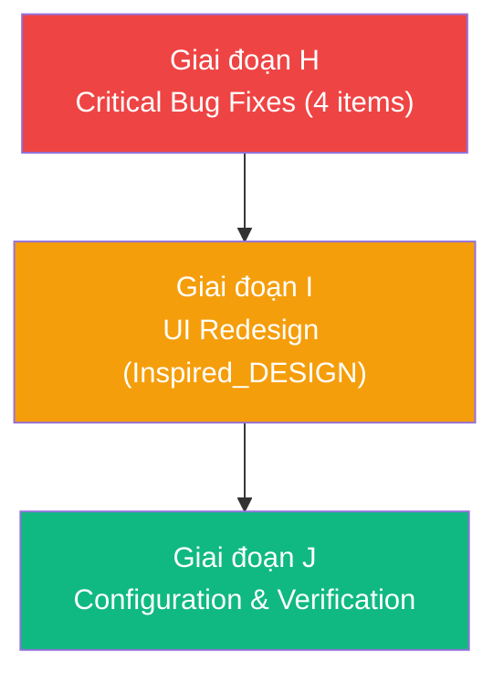

# Plan UAT 2 — Bug Fixes from Smoke Test Round 2

> **Nguồn:** [SMOKE_TEST_RESULT_2.md](uat/SMOKE_TEST_RESULT_2.md) + [DOM_PANEL.md](uat/DOM_PANEL.md) + [jira-ticket.md](uat/jira-ticket.md)  
> **Trạng thái:** Chờ duyệt  
> **Ước tính effort:** 3 giai đoạn (H → I → J)  
> **Scenarios:** 7 (đã loại bỏ scenario #2 — tester nhầm)

---



---

## Tổng quan 7 scenarios

| # | Scenario | Mức độ | Giai đoạn |
|---|----------|--------|-----------|
| 1 | DOM bị reset khi chuyển tab (SPA navigation) — Panel mở ra thấy trống hoặc chỉ vài event | 🔴 P0 Critical | H |
| ~~2~~ | ~~Export ZIP chứa data ticket cũ~~ | ~~Loại bỏ~~ | — |
| 3 | Console tab cần checkbox để select/deselect (giống Network) | 🟡 P1 Enhancement | H |
| 4 | Export chỉ xuất API được checked ở Network (popup filter sai) | 🔴 P0 Critical | H |
| 5 | Export lần 2 không tải được — cần giữ data cho đến new recording | 🔴 P0 Critical | H |
| 6 | Buttons có quá nhiều border — minimal hơn | 🟢 P2 UI Polish | I |
| 7 | Follow Inspired_DESIGN.md (Mistral AI warm design system) | 🟢 P2 UI Redesign | I |
| 8 | Tạo env/config để dễ thay đổi app name, description, icon | 🟡 P1 DX | J |

---

## Giai đoạn H — Critical Bug Fixes (4 items)

### H1. DOM bị reset khi chuyển tab (Scenario #1)

> **Triệu chứng:** Record ở tab 1 → SPA redirect sang tab 2 → redirect về list → mở Panel thấy DOM **trống rỗng** hoặc chỉ có vài event gần nhất  
> **Lưu ý từ tester:** Trường hợp DOM_PANEL.md (53 steps) là lúc panel mở **trong khi record** → data live. Vấn đề xảy ra khi record xong rồi mới mở panel → mất hết.

**Root Cause — Phân tích code:**

Content script (`src/content/index.js`) chạy ở `document_idle` trên **mỗi navigation**. Trong MV3, khi SPA navigation dùng **hard redirect** (không phải pushState/replaceState) hoặc khi browser navigates sang URL mới (ví dụ form submit → server redirect):

1. Content script bị **destroy** khi page unload
2. Browser load trang mới → content script **re-inject** (vì `matches: <all_urls>`)
3. Content script mới chạy startup check → `QUERY_STATUS` → `status === 'recording'` → gọi `startCollecting()` ✅
4. **NHƯNG**: `startCollecting()` gọi `steps = []` → reset tất cả events đã thu thập ✅ (đúng behavior)
5. **Vấn đề thực sự**: Khi content script cũ bị destroy, `stopCollecting()` **KHÔNG được gọi** → events đã thu thập ở tab cũ **bị mất vĩnh viễn** vì chưa được gửi về background

Ngoài ra, background nhận DOM events qua `MSG.DOM_EVENT` real-time **HOẶC** qua batch khi `stopRecording()` gọi `sendMessage(MSG.STOP_RECORDING)`. Nhưng nếu content script bị destroy giữa chừng, cả hai pathway đều mất data.

**Giải pháp — 2 tầng bảo vệ:**

**H1a. Flush events trước khi page unload (content script):**

```js
// src/content/index.js — thêm beforeunload/visibilitychange listener
window.addEventListener('beforeunload', () => {
  if (!isCollecting) return
  // Emergency flush — gửi tất cả collected steps về background ngay lập tức
  const { steps, consoleErrors } = getStepsAndClear()
  if (steps.length > 0 || consoleErrors.length > 0) {
    // Dùng sendMessage (sync-ish trong beforeunload context)
    chrome.runtime.sendMessage({
      type: MSG.FLUSH_EVENTS,
      payload: { steps, consoleErrors }
    })
  }
})
```

**H1b. Background xử lý `FLUSH_EVENTS`:**

```js
// src/background/index.js — thêm handler cho FLUSH_EVENTS
if (msg.type === MSG.FLUSH_EVENTS) {
  const state = await getState()
  if (state.status !== 'recording') return
  const merged = [...state.steps, ...(msg.payload.steps || [])].slice(0, MAX_ENTRIES)
  const mergedConsole = [...state.consoleErrors, ...(msg.payload.consoleErrors || [])].slice(0, MAX_ENTRIES)
  await setState({ steps: merged, consoleErrors: mergedConsole })
}
```

**H1c. Thêm periodic sync (belt + suspenders):**

Mỗi 5 giây, content script sync events lên background (không chờ stop). Đây là cách Sentry/LogRocket hoạt động.

```js
// src/content/eventCollector.js — thêm periodic sync
let syncInterval = null
const SYNC_INTERVAL_MS = 5000

// Trong startCollecting():
syncInterval = setInterval(() => {
  const { steps, consoleErrors } = getStepsAndClear()
  if (steps.length > 0 || consoleErrors.length > 0) {
    chrome.runtime.sendMessage({
      type: MSG.FLUSH_EVENTS,
      payload: { steps, consoleErrors }
    })
  }
}, SYNC_INTERVAL_MS)

// Trong stopCollecting():
clearInterval(syncInterval)
syncInterval = null
```

> [!WARNING]
> `getStepsAndClear()` đã clear steps sau mỗi lần gọi. Cần đảm bảo `stopRecording()` trong background **KHÔNG double-count** events đã sync trước đó. Giải pháp: Background sẽ accumulate vào `state.steps`. Final `STOP_RECORDING` response từ content script chỉ gửi **remaining** (chưa sync) events.

**Files cần thay đổi:**

| File | Thao tác |
|---|---|
| `src/content/index.js` | **[MODIFY]** — Thêm `beforeunload` flush + periodic sync interval |
| `src/content/eventCollector.js` | **[MODIFY]** — Thêm periodic sync logic trong startCollecting/stopCollecting |
| `src/background/index.js` | **[MODIFY]** — Thêm `MSG.FLUSH_EVENTS` handler |
| `src/shared/messages.js` | **[MODIFY]** — Thêm `FLUSH_EVENTS` message type |

---

### ~~H2. (Loại bỏ — Scenario #2 tester nhầm)~~

---

### H3. Console tab thêm checkbox select/deselect (Scenario #3)

> **Yêu cầu:** Console errors nên có checkbox giống Network tab để user chọn errors muốn export  
> **Lý do:** Nhiều errors đến từ third-party libs (TinyMCE, analytics...) — không relevant

**Giải pháp:** Tạo `ConsolePanel.jsx` component tương tự `NetworkPanel.jsx`:

- Mỗi console error có checkbox (toggle qua `selectedConsoleErrors` Set)
- Filter pills: All / Errors / Warnings
- Search bar: filter by message text
- Export chỉ xuất selected console errors

```jsx
// ConsolePanel.jsx — skeleton
export default function ConsolePanel({ consoleErrors, selected, onToggle }) {
  // Tương tự NetworkPanel: filter + search + checkbox per item
  // Selected state quản lý bởi parent App.jsx
}
```

**Files cần thay đổi:**

| File | Thao tác |
|---|---|
| `src/panel/ConsolePanel.jsx` | **[NEW]** — Console panel với checkbox, filter, search |
| `src/panel/App.jsx` | **[MODIFY]** — Thêm `selectedConsoleErrors` state, pass vào ConsolePanel; update export logic |

---

### H4. Export chỉ xuất API được checked ở Network (Scenario #4)

> **Triệu chứng:** Popup export tất cả API, không respect selection trong Side Panel  
> **Evidence code:** `Popup.jsx:174` — filter chỉ by error status, không có concept "selected"

**Root Cause:**

Panel App.jsx **ĐÃ** implement đúng — line 54:
```jsx
apiRequests: (session.apiRequests || []).filter((r) => selectedRequests.has(r.requestId)),
```

**NHƯNG** Popup.jsx line 174 dùng filter riêng:
```jsx
apiRequests: (session.apiRequests || []).filter((r) => !r.status || r.status >= 400),
```

→ Popup **không biết** selected state từ Panel → export tất cả errors.

**Giải pháp:**

Lưu `selectedRequests` và `selectedConsoleErrors` vào `chrome.storage.session` mỗi khi thay đổi. Popup và Panel đều đọc từ đó.

```js
// App.jsx — khi toggle selection, sync vào storage
useEffect(() => {
  chrome.storage.session.set({ vcapSelectedRequests: [...selectedRequests] })
}, [selectedRequests])

// Popup handleExport — đọc selections từ storage
const { vcapSelectedRequests = [] } = await chrome.storage.session.get('vcapSelectedRequests')
const selectedSet = new Set(vcapSelectedRequests)
```

**Files cần thay đổi:**

| File | Thao tác |
|---|---|
| `src/panel/App.jsx` | **[MODIFY]** — Sync selectedRequests + selectedConsoleErrors vào chrome.storage.session |
| `src/popup/Popup.jsx` | **[MODIFY]** — `handleExport` đọc selections từ storage |

---

### H5. Export lần 2 không tải được (Scenario #5)

> **Triệu chứng:** Sau khi export ZIP 1 lần, click export lần 2 → không tải được  
> **Yêu cầu:** Data phải giữ cho đến khi user start new recording

**Root Cause — `zipExporter.js:93-96`:**

```js
} finally {
  await clearChunks()       // ← xóa video chunks từ IDB
  await clearScreenshots()   // ← xóa screenshots từ IDB
}
```

**Sau khi export, video và screenshots bị xóa** → lần export thứ 2 fail vì `readAllChunks()` trả về empty blob.

**Giải pháp:**

1. **KHÔNG xóa IDB data trong `exportSession()`** — chỉ xóa khi `startRecording()` (new recording)
2. Thêm hàm `clearSessionData()` gọi trong `startRecording()` flow thay vì end of export

```js
// zipExporter.js — bỏ clearChunks/clearScreenshots từ finally block
// => caller quyết định khi nào clear

// background/index.js — START_RECORDING_REQUEST handler đã có:
try { await clearChunks() } catch (_) {}  // ← ĐÃ CÓ
// Thêm: await clearScreenshots()
```

**Files cần thay đổi:**

| File | Thao tác |
|---|---|
| `src/utils/zipExporter.js` | **[MODIFY]** — Bỏ `finally { clearChunks(); clearScreenshots() }` |
| `src/background/index.js` | **[MODIFY]** — Thêm `clearScreenshots()` vào `startRecording` flow |

---

## Giai đoạn I — UI Redesign (Inspired_DESIGN.md)

### I1. Áp dụng Mistral AI warm design system (Scenario #6 + #7)

> **Yêu cầu:** Follow design system trong `design/Inspired_DESIGN.md` + giảm border buttons

**Tóm tắt thay đổi design:**

| Aspect | Hiện tại (Dark Cyan/Blue) | Mới (Mistral Warm) |
|---|---|---|
| **Background** | `#0e0e0e` (near-black) | `#1f1f1f` (Mistral Black) cho dark mode |
| **Primary Color** | `#81ecff` (cyan) | `#fa520f` (Mistral Orange) |
| **Accent** | `#00e3fd` (bright cyan) | `#ffa110` (Sunshine Amber) |
| **Secondary** | `#7799ff` (blue) | `#ffb83e` (Sunshine 500) |
| **Text** | `#ffffff` | `#ffffff` (giữ nguyên trên dark) |
| **Muted text** | `#ababab` | `#b0b0b0` (warmer gray) |
| **Surface** | `#191919` | `#262626` (warmer surface) |
| **Borders** | Visible borders everywhere | Minimal — define by bg color + shadow |
| **Radius** | `rounded-xl` (12px) | Near-zero / `rounded` (4px) — sharp, architectural |
| **Shadows** | None | Warm golden shadow (`rgba(127,99,21,0.12)`) |
| **Buttons** | Bordered, gradient | Borderless, solid bg (Dark or Cream) |
| **Font** | Space Grotesk / Manrope / Inter | Keep current (extension context — readable) |
| **Gradient** | Cyan gradient | Amber-orange gradient `#ffd900 → #fa520f` |

> [!IMPORTANT]
> Vì đây là Chrome extension (350–420px width), không áp dụng 82px display text hay full-page layouts. Chỉ áp dụng: **color palette, shadow system, button styling, border philosophy, gradient direction**.

**Cụ thể:**

**I1a. Tailwind config — themes mới:**

```js
// tailwind.config.js — replace colors
colors: {
  'background': '#1f1f1f',               // Mistral Black
  'surface': '#1f1f1f',
  'surface-dim': '#161616',
  'surface-container': '#262626',
  'surface-container-high': '#303030',
  'surface-container-highest': '#3a3a3a',
  'on-surface': '#ffffff',
  'on-surface-variant': '#b0b0b0',
  'primary': '#fa520f',                   // Mistral Orange
  'primary-container': '#ff8105',         // Block Orange  
  'primary-dim': '#fb6424',              // Flame
  'on-primary': '#ffffff',
  'on-primary-container': '#1f1f1f',
  'secondary': '#ffa110',                // Sunshine 700
  'secondary-dim': '#ff8a00',            // Sunshine 900
  'tertiary': '#ffd900',                 // Bright Yellow
  'error': '#ff716c',                    // Keep current
  'outline-variant': '#3a3a3a',          // Warmer
  'cream': '#fff0c2',                    // Cream surface (light accent)
  'warm-ivory': '#fffaeb',              // Warm ivory
  // ... rest
}
```

**I1b. Button cleanup — bỏ border, dùng solid bg:**

Tất cả buttons trong Popup + Panel:
- **Primary CTA**: bg Mistral Orange `#fa520f`, text white, no border, sharp corners
- **Secondary**: bg `#262626`, text white, no border
- **Ghost**: transparent bg, no border, opacity hover
- Recording state: gradient `#ff8a00 → #fa520f` (warm) thay vì `#b35000 → #ffaa55`

**I1c. CSS file updates:**

```css
/* popup.css + panel.css — Mistral warm palette */
html, body { background-color: #1f1f1f; }
.custom-scrollbar::-webkit-scrollbar-thumb { background: #3a3a3a; }
```

**Files cần thay đổi:**

| File | Thao tác |
|---|---|
| `tailwind.config.js` | **[MODIFY]** — Replace color palette to Mistral warm |
| `src/popup/popup.css` | **[MODIFY]** — Background + scrollbar → warm colors |
| `src/panel/panel.css` | **[MODIFY]** — Background + scrollbar + animations → warm colors |
| `src/popup/Popup.jsx` | **[MODIFY]** — Button styles: bỏ border, sharp corners, warm gradients |
| `src/panel/App.jsx` | **[MODIFY]** — Button styles + header + warm accents |
| `src/panel/NetworkPanel.jsx` | **[MODIFY]** — Warm accent colors cho status dots |
| `src/panel/ConsolePanel.jsx` | **[MODIFY]** — Match warm design (mới tạo ở H3) |

---

## Giai đoạn J — Configuration & Verification

### J1. App info centralized config (Scenario #8)

> **Yêu cầu:** Dễ dàng thay đổi tên app, description, icon cho branding

**Giải pháp — Tạo file `vcap.config.js` ở root:**

```js
// vcap.config.js — Single source of truth for app branding
export default {
  // App identity — change these to rebrand
  APP_NAME: 'VCAP',
  APP_TITLE: 'VCAP — QA Debug Assistant',
  APP_DESCRIPTION: 'Record bugs locally: video, DOM steps, API errors → .zip export. 100% local processing.',
  APP_VERSION: '0.1.0',

  // Icons (relative to project root)
  ICONS: {
    '16': 'icons/icon16.svg',
    '48': 'icons/icon48.svg',
    '128': 'icons/icon128.svg',
  },

  // Export defaults
  DEFAULT_TICKET_PREFIX: 'vcap',
  ZIP_MARKDOWN_NAME: 'jira-ticket.md',
  ZIP_VIDEO_NAME: 'bug-record.webm',
}
```

**Sử dụng:**

1. **`manifest.json`** — Vite plugin đọc config và inject vào manifest tại build time
2. **Popup / Panel / Export** — Import config trực tiếp:
   ```js
   import config from '../../vcap.config.js'
   // Dùng config.APP_NAME thay vì hardcode 'VCAP'
   ```
3. **Markdown builder** — dùng `config.ZIP_MARKDOWN_NAME` cho filename

**Files cần thay đổi:**

| File | Thao tác |
|---|---|
| `vcap.config.js` | **[NEW]** — App branding config |
| `manifest.json` | **[MODIFY]** — Không cần thay đổi trực tiếp nếu dùng Vite plugin, hoặc keep hardcoded + comment reference |
| `src/popup/Popup.jsx` | **[MODIFY]** — Import config cho APP_NAME |
| `src/panel/App.jsx` | **[MODIFY]** — Import config cho APP_NAME |
| `src/utils/zipExporter.js` | **[MODIFY]** — Import config cho file names |
| `vite.config.js` | **[MODIFY]** — Read `vcap.config.js` inject vào manifest (optional) |

---

### J2. Build & Unit Tests

```bash
npm test           # Tất cả tests pass
npm run build      # Build pass, không warning
```

### J3. Smoke Re-test (all 8 scenarios)

| # | Test | Nội dung | Trạng thái |
|---|---|---|---|
| 1 | SPA navigation | Tab 1 → SPA redirect tab 2 → redirect về list → DOM events preserved | |
| 3 | Console checkbox | Console tab hiện checkboxes, filter, search | |
| 4 | Export selected only | Uncheck 1 API ở Network → Export → ZIP chỉ chứa checked APIs | |
| 5 | Re-export | Export → click Export lần 2 → tải lại thành công | |
| 6 | Button borders | Buttons không có visible borders | |
| 7 | Warm design | UI dùng Mistral warm palette (amber/orange), sharp corners | |
| 8 | App config | Đổi APP_NAME trong config → build → tên thay đổi đúng | |

---

## Tổng hợp Files

### Files mới (NEW)

| File | Giai đoạn | Mô tả |
|---|---|---|
| `src/panel/ConsolePanel.jsx` | H3 | Console panel với checkbox/filter/search |
| `vcap.config.js` | J1 | Centralized app branding config |

### Files cần sửa (MODIFY)

| File | Giai đoạn | Thay đổi chính |
|---|---|---|
| `src/content/index.js` | H1 | beforeunload flush + periodic sync |
| `src/content/eventCollector.js` | H1 | Periodic sync interval |
| `src/background/index.js` | H1, H5 | FLUSH_EVENTS handler + clearScreenshots on start |
| `src/shared/messages.js` | H1 | Thêm FLUSH_EVENTS message type |
| `src/panel/App.jsx` | H3, H4, I1 | ConsolePanel integration + selection sync + warm design |
| `src/popup/Popup.jsx` | H4, I1, J1 | Selection from storage + warm design + config |
| `src/panel/NetworkPanel.jsx` | I1 | Warm accent colors |
| `src/utils/zipExporter.js` | H5, J1 | Bỏ auto-clear after export + config import |
| `tailwind.config.js` | I1 | Mistral warm color palette |
| `src/popup/popup.css` | I1 | Warm colors |
| `src/panel/panel.css` | I1 | Warm colors + animations |

---

## Thứ tự thực hiện

```
H1 (DOM flush) → H5 (re-export) → H4 (selected export) → H3 (console panel)
→ I1a (tailwind) → I1b (popup) → I1c (panel) → I1d (network panel)
→ J1 (config) → J2 (tests) → J3 (smoke test)
```

> ⚠️ **Giai đoạn H (bug fixes) nên ship trước I (UI redesign).** Có thể merge H → verify → rồi mới bắt tay I + J.
